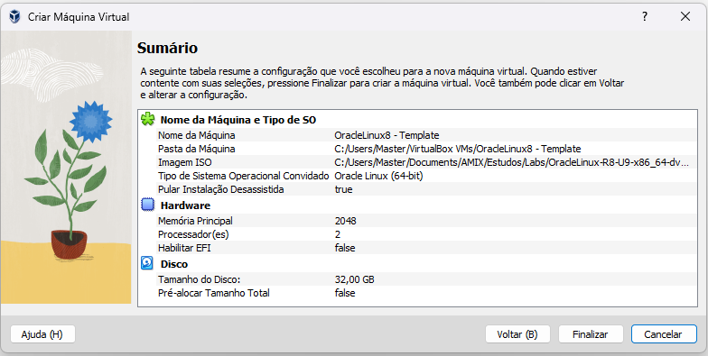

# Subindo um Oracle Linux 8

Ferramenta utilizada: Oracle VM Box

## Criação da VM
- Baixar a ISO do Oracle Linux 8
- Criar uma nova VM no VM Box
  - Colocar o nome e selecionar a ISO
  - Pular a instalação desassistida
  - RAM: 2048 MB
  - CPU: 2
  - Tamanho do disco: 32 GB

- Ligar a VM

- Configuração das partições:
/boot: 1G
/ : 4G
/var: 2G
/var/cache: 2G
/var/tmp: 1G
/var/log: 2G
swap: 4G
/home: 128M
/opt: 1G
/tmp: 2G